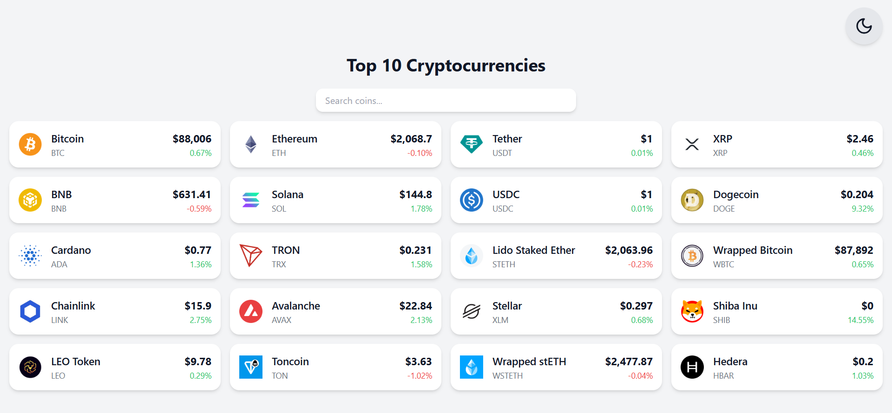

# 💸 Crypto Dashboard

A responsive, modern cryptocurrency dashboard built with React 19 and Vite, powered by real-time data from the CoinGecko API.



[🌍 Live Demo](https://akopjandvd.github.io/crypto-dashboard/) • [🧪 CI Status](https://github.com/akopjandvd/crypto-dashboard/actions)

---

## ✨ Features

- 🔍 Real-time coin search with filtering
- 🌗 Animated dark/light mode toggle (🌞 / 🌙)
- 🔄 Live price updates from CoinGecko API
- 📱 Fully responsive and mobile-friendly layout
- ✅ Unit & component tests with Vitest and Testing Library
- ⚙️ Continuous Integration via GitHub Actions
- 🌍 Deployed with GitHub Pages

---

## 🛠️ Tech Stack

- [React 19 (canary)](https://react.dev)
- [Vite](https://vitejs.dev)
- [Tailwind CSS](https://tailwindcss.com)
- [Framer Motion](https://www.framer.com/motion/)
- [Lucide Icons](https://lucide.dev)
- [CoinGecko API](https://www.coingecko.com/en/api)

---

## 🧪 Testing

```bash
npm run test
```

The project uses `vitest` and `@testing-library/react` to provide fast and reliable tests.  
Tests include mock API responses and simulated user interactions.

---

## 🚀 Deployment

The app is deployed using GitHub Pages from the `gh-pages` branch.

```bash
npm run deploy
```

Make sure to update the `base` path in `vite.config.js` with your repository name:

```js
base: "/crypto-dashboard/"
```

---

## 📸 Screenshot

> Add a screenshot of your app as `screenshot.png` in the project root to showcase your UI.

---

## 📍 Roadmap

- [ ] 📈 Historical price chart (Chart.js / Recharts)
- [ ] ⭐ Add to favorites (using `localStorage`)
- [ ] 🔔 Price alert notifications
- [ ] 👤 User authentication
- [ ] 🤖 AI-generated price summaries (local LLM or OpenAI API)

---

## 👤 Author

> [@akopjandvd](https://github.com/akopjandvd) – Software engineer. This project was created for portfolio and learning purposes.
